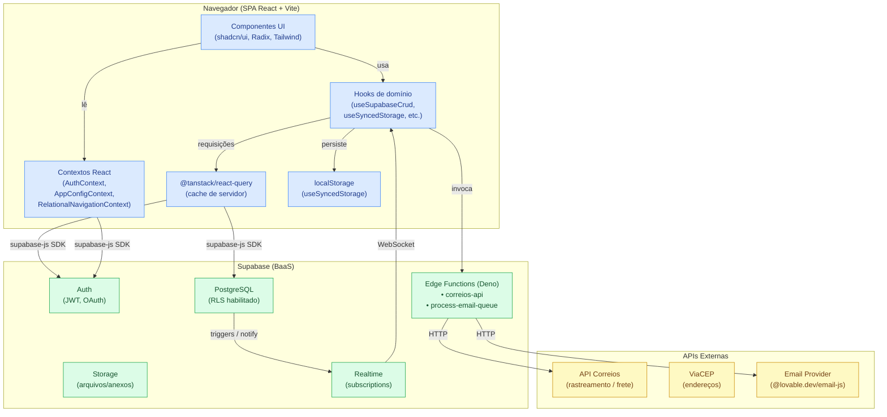
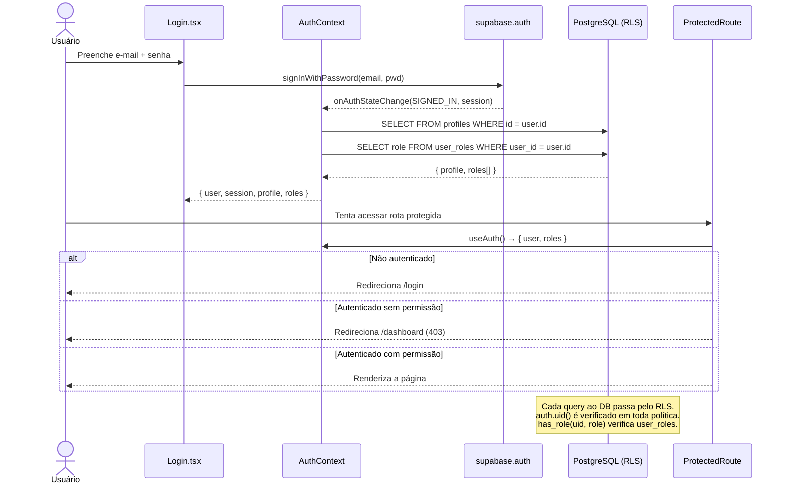
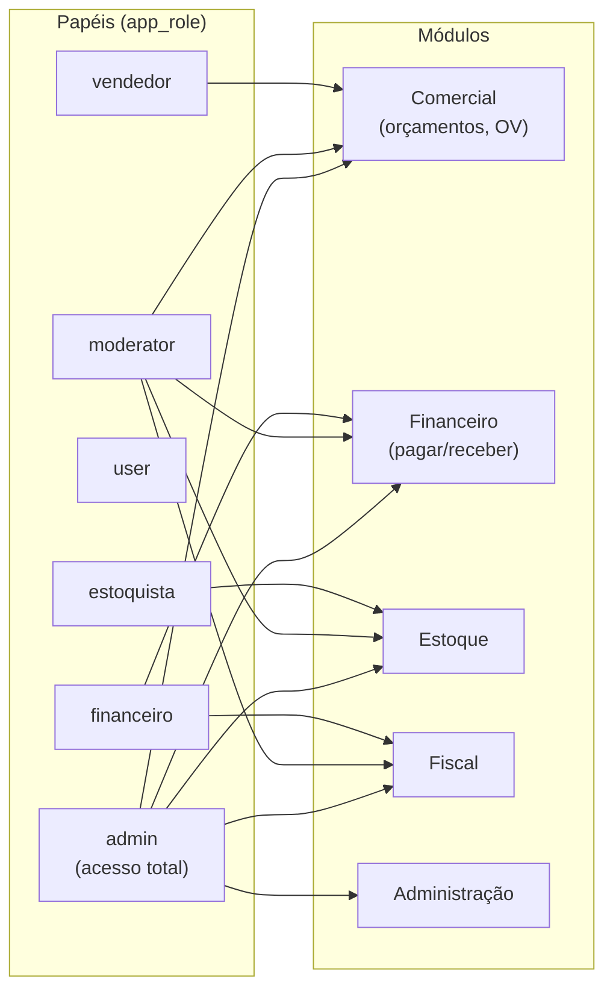
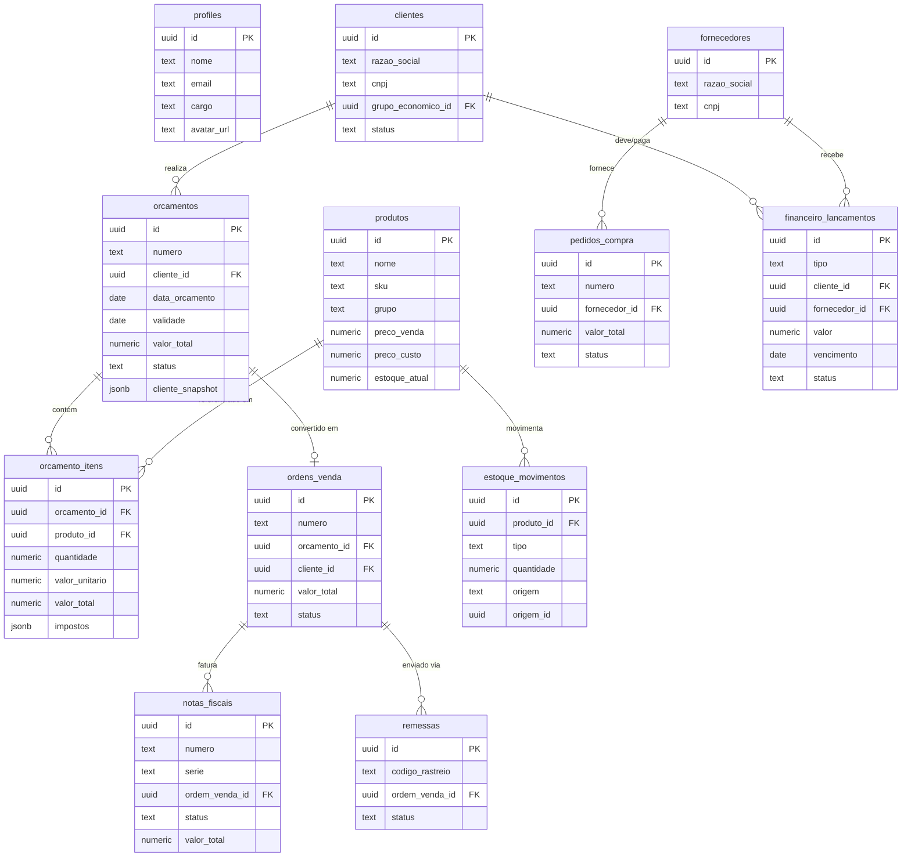
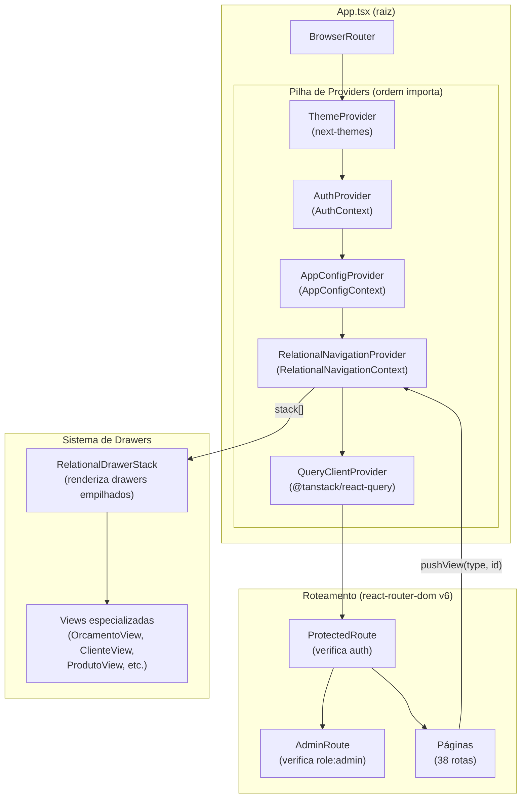
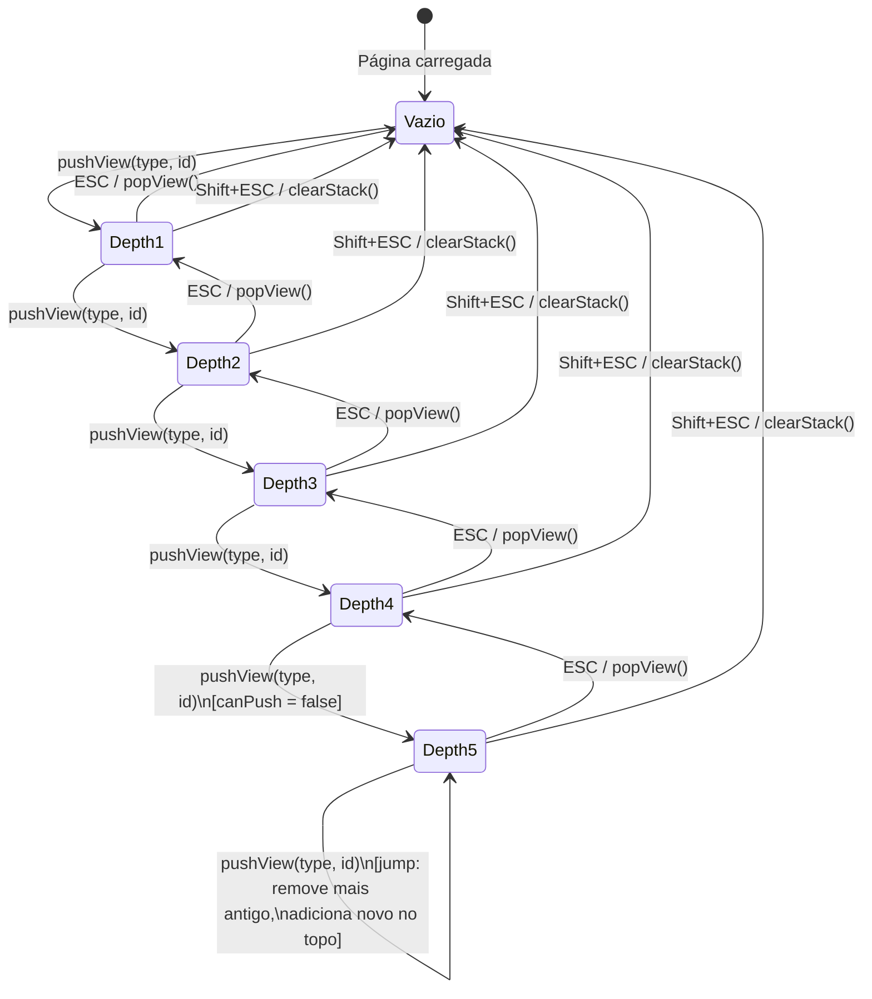
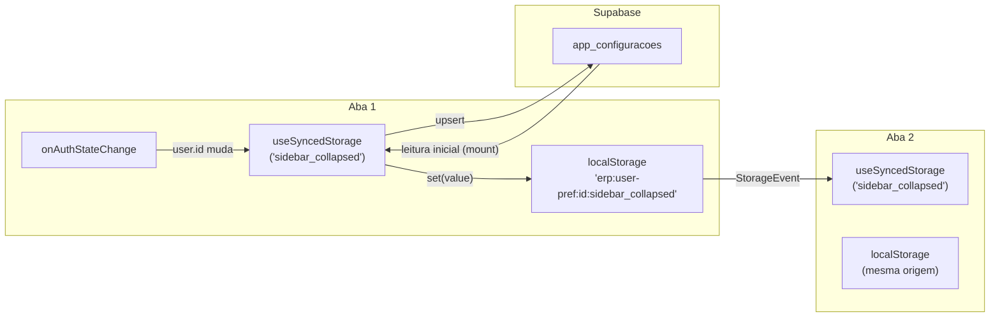
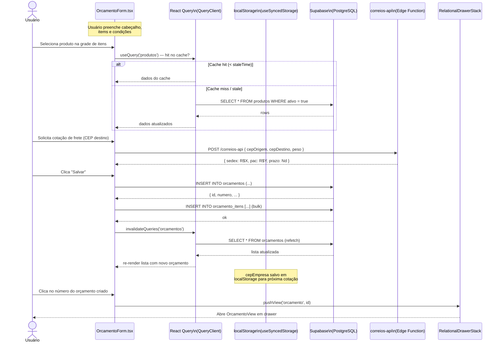

# Arquitetura — ERP AviZee

Este documento descreve a arquitetura técnica do ERP AviZee com diagramas Mermaid renderizáveis diretamente no GitHub.

---

## 1. Visão Geral da Arquitetura

O sistema é uma SPA (Single Page Application) React que se comunica exclusivamente com o Supabase como backend. Não há servidor intermediário: toda a lógica de negócio crítica que precisa ser protegida vive em Edge Functions Deno (serverless) ou em políticas de banco de dados (RLS + funções PL/pgSQL).

---

## 2. Fluxo de Autenticação e Autorização

O Supabase Auth gerencia sessões via JWT. O controle de acesso ao banco opera em duas camadas: RLS (qual linha o usuário pode ver/alterar) e RBAC via `user_roles` (qual funcionalidade o usuário pode acessar na UI).

### Papéis e Permissões

---

## 3. Modelo de Dados Principal

Diagrama de entidades e relacionamentos para os módulos mais críticos do sistema.

---

## 4. Fluxo de Navegação e Contexto de Estado

### Contextos React e suas responsabilidades

### Fluxo de navegação por drawer

### Sincronização de cache (useSyncedStorage)

---

## 5. Diagrama de Sequência — Criação de Orçamento

Fluxo completo desde a interação do usuário até a persistência no banco, incluindo cache, Edge Functions opcionais e atualização da UI.

---

## Decisões de Arquitetura (ADRs)

| # | Decisão | Motivação |
|---|---------|-----------|
| 1 | **Supabase como único backend** | Reduz infraestrutura, RLS garante segurança por linha, Auth gerenciado, Edge Functions para lógica protegida |
| 2 | **Cache write-through com localStorage** | UI instantânea entre page-loads; cross-tab sync nativo via `StorageEvent` |
| 3 | **Sem Redux/Zustand** | React Query gerencia cache de servidor; contextos cobrem estado de UI global; complexidade controlada |
| 4 | **Drawers empilhados (RelationalNavigation)** | Permite navegar entre entidades vinculadas sem perder contexto da página principal |
| 5 | **URL como fonte de verdade para drawers** | Permite compartilhar links com estado de navegação, bookmarking e histórico do browser |
| 6 | **Edge Functions apenas para lógica sensível** | Lógica de negócio que requer secrets (Correios, email) fica isolada no servidor; o resto é client-side |
| 7 | **shadcn/ui (cópia local de componentes)** | Controle total sobre o código dos componentes; sem lock-in de versão de biblioteca de UI |
